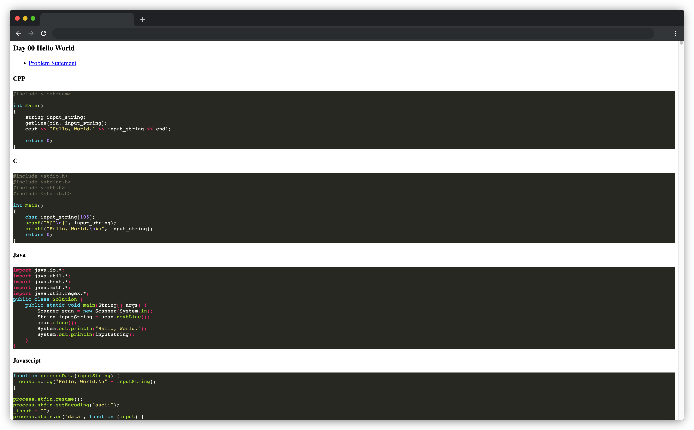

# Hugle

Google Docs styled blog theme in [Hugo](https://gohugo.io/).


[Demo](https://ahampriyanshu.com/blog) &nbsp; | &nbsp; [Setup](./##Usage) &nbsp;



## Features

- [x] Responsive
- [x] Google Analytics
- [x] SEO support 🚀

## Development

```bash
brew install git node go hugo
git clone https://github.com/ahampriyanshu/blog.git hugle
cd hugle
yarn
yarn dev
```
